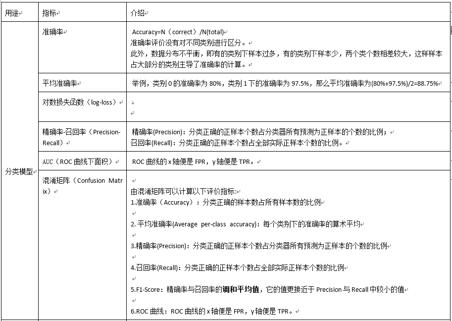
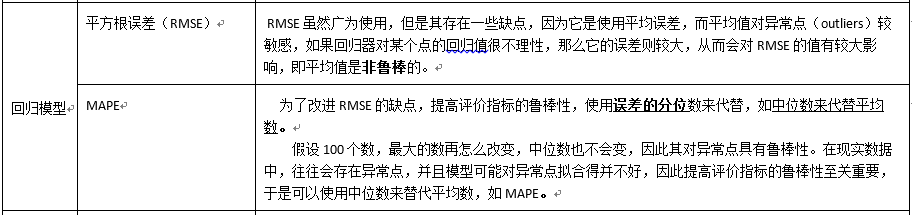

### 1、抽象成数学问题
    明确问题是进行机器学习的第一步, 目标是一个分类、回归或者是聚类的问题，如果都不是的话，划归为其中的某类问题。
### 2、数据的收集
    开放数据集
    爬虫抓取
    传感器
    日志采集
### 3、数据预处理
    探索性数据分析, 数据预处理, pandas
    对于分类问题，数据偏斜不能过于严重，不同类别的数据数量不要有很大的差距。
##### 处理缺失值
    删除元组: 缺失值的对象与初始数据集的数据量相比非常小的情况下非常有效, 缺失数据多的时候会导致结果错误
    数据填充: 用一定的值去填充空值，常用的方法，
        人工填充、
        特殊值填充、
        均值、
        众数、
        中位数填充、
        就近补齐、
        预测填充等
    不处理
##### 异常值检验
    常用的是: 
        箱形图检验、
        均方差检验、
        DBScan 聚类、
        孤立森林
##### 数据规范化
    数据规范化一般指0-1规范化，Z-Score规范化。
    0-1规范化(MinMax normalization)：将原始数据缩放到[0,1]区间内
    缺点是: 当有新数据加入时，可能会导致最大值最小值发生变化，需要重新计算。

    Z-Score(Standardzation): 将原始数据转换为标准正态分布, 即原始数据离均值有几个标准差
    缺点是: 对原始数据的分布有要求, 要求原始数据数据分布为正态分布计算; 
           在真实世界中，总体的均值和标准差很难得到，只能用样本的均值和标准差求得。
    在Python的sklearn包中提供了StandardScaler 和 MinMaxScaler

##### 数据的转换
    数据转换主要指将非数值变量转换为可以放入模型的数值变量，常用的方法有，
        one-hot编码，
        label_encoder编码。
    在sklearn包中提供了OneHotEncoder和LabelEncoder函数。

### 4、特征工程
    特征工程主要有特征衍生和特征选择
##### 特征衍生
    是指利用现有的特征进行某种组合生成新的特征，主要是从业务数据和纯技术生产特征方面着手。
    业务衍生是从特征的业务意义出发，生成具有不同层面业务含义的新特征。
    方法：
        逻辑关联、增量、频率分析、相对强度水平等。
    
    技术衍生是在特征计算层次上对特征进行大范围加工衍生。
    方法：
        相关特征的加减乘除方、二值化、离散化、交叉组合、多项式融合、算法衍生等。
##### 特征选择
    特征选择是指衍生出的所有特征都不一定都对模型有效，所以对特征进行有效的选择。
    选出显著特征、摒弃非显著特征。需要机器学习工程师反复理解业务。
    特征选择好了，非常简单的算法也能得出良好、稳定的结果。这需要运用特征有效性分析的相关技术，
    如相关系数、卡方检验、平均互信息、条件熵、后验概率、逻辑回归权重等方法。

### 5、数据集分割
    训练集(train set)          50％
    验证集(validation set)     25％
    测试集(test set)           25％
    训练集用来估计模型，验证集用来调整模型参数从而得到最优模型，而测试集则检验最优的模型的性能如何
    
### 6、模型的选择与训练
    1. 首先我们要对处理好的数据进行分析，判断训练数据有没有类标，若是有类标则应该考虑监督学习的模型，否则可以划分为非监督学习问题。
    2. 其次分析问题的类型是属于分类问题还是回归问题，当我们确定好问题的类型之后再去选择具体的模型。
    3. 再次，我们还会考虑到数据集的大小。若是数据集样本较少，训练的时间较短，通常考虑朴素贝叶斯等一些轻量级的算法，否则的话就要考虑SVM等一些重量级算法。
    4. 最后，调优问题，可以采用交差验证，观察损失曲线，测试结果曲线等分析原因，调节参数：优化器、学习率、batchsize等。此外还可以尝试多模型融合，来提高效果。
    简而言之: 
        1. 分析是有监督还是无监督
        2. 分析是分类问题还是回归问题
        3. 分析数据的大小考虑轻量级还是重量级算法
        4. 调优
            交叉验证
            观察损失曲线, 结果曲线
            调参: 优化器, 学习率, batchsize

### 7、模型的评价

    对数损失函数也逻辑斯谛回归损失(Logistic Loss)或交叉熵损失(cross-entropy Loss),是在概率估计上定义的。
    如果只有两类 {0, 1}, 则对数损失函数的公式简化为

    过拟合：
        若是存在数据过度拟合的现象，说明我们可能在训练过程中把噪声也当作了数据的一般特征，
        可以通过增大训练集的比例或是正则化的方法来解决过拟合的问题。
    欠拟合：
        若是存在数据拟合不到位的情况，说明我们数据训练的不到位，未能提取出数据的一般特征，
        要通过增加多项式维度、减少正则化参数等方法来解决欠拟合问题。
    此外，模型评估还应考虑时间、空间复杂度，稳定性、迁移性等。
### 8、 模型融合
    工程上，主要提升算法准确度的方法是分别在
        模型的前端（特征清洗和预处理，不同的采样模式）
        后端（模型融合）上下功夫

### 9、 上线运行
    模型在线上运行的效果直接决定模型的成败。
    不单纯包括其准确程度、误差。
    还包括其运行的速度(时间复杂度)、资源消耗程度（空间复杂度）、稳定性是否可接受。
