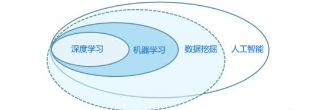
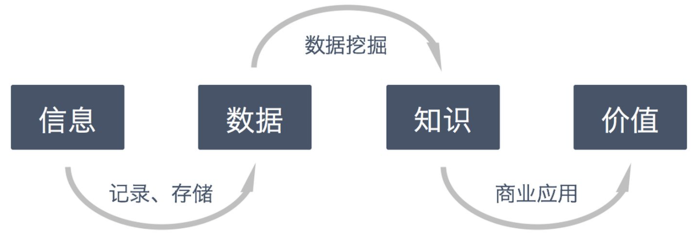

### 数据挖掘与人工智能的关系

### 数据挖掘定义
    数据挖掘（Data Mining）是指通过大量数据集进行分类的自动化过程，以通过数据分析来识别趋势和模式，建立关系来解决业务问题
    数据挖掘是从大量的、不完全的、有噪声的、模糊的、随机的数据中提取隐含在其中的、人们事先不知道的、但又是潜在有用的信息和知识的过程。

### 数据挖掘过程
##### 解读需求：我们需要完成什么样的目标？
    
##### 搜集数据：我们需要从哪里获得数据？
    
##### 预处理数据：如何处理出完整、干净的数据？
    数据准备
        缺失值处理、异常值处理、归一化、平整化、时间序列加权
    数据归约
        维度归约、值归约、以及案例归约
##### 选择算法：该如何选择一个适合我需求的算法？
    
##### 评估模型：如何确认我们的模型已经达标？
    
##### 解释模型：我们的模型是否可以解决业务需求？
    
### 1、分类问题
    KNN 算法：对若干种水果进行分类

    决策树：根据天气情况决定去哪里玩什么
    
    朴素贝叶斯：根据人名来预测其性别
    
    支持向量机（SVM）：用一条线分开红豆与绿豆
    
    人工神经网络：当前最火热的深度学习模型的基础

### 2、聚类问题
    k-means 聚类：擒贼先擒王，找到中心点，它附近的都是一类
    
    DBScan 聚类：打破形状的限制，使用密度聚类

### 3、回归问题
    线性回归与逻辑回归：找到一个函数去拟合数据

### 4、关联分析
    Apriori 与 FP-Growth：最经典的就是啤酒与尿布的故事

### 数据挖掘工具
    Python科学计算工具包：Numpy、Pandas
    
    Python画图相关工具包：Matplotlib
    
    机器学习相关算法库：Sklearn
    
    Python代码编译器：Pycharm、Jupyter Notebook

### 相关代码实践
    https://www.cnblogs.com/bigbigbird/p/12960460.html

### 数据挖掘相关书籍
    Jiawei Han的《数据挖掘概念与技术》

    Ian H. Witten / Eibe Frank的《数据挖掘实用机器学习技术》
    
    Tom Mitchell的《机器学习》
    
    TOBY SEGARAN的《集体智慧编程》
    
    Anand Rajaraman的《大数据》
    
    Pang-Ning Tan的《数据挖掘导论》
    
    Matthew A. Russell的《社交网站的数据挖掘与分析》
    
    《数据挖掘概念与技术》
    
    《机器学习实战》
    
    《人工智能及其应用》

### 数据挖掘在各行业的应用
    零售商可以部署数据挖掘，以更好地识别人们根据过去的购买习惯可能购买哪个产品，或者哪些商品在一年的某些时间可能热卖。这可以帮助商家规划库存和存储布局，同时也可以利用数据挖掘来做线下零售店铺的智能选址。
    
    银行和其它金融服务提供商可以挖掘与其客户帐户、交易和渠道偏好相关的数据，以更好地满足他们的需求。它们还可以从他们的网站和社交媒体互动中分析数据，以增加现有客户的忠诚度并吸引新客户。
    
    制造企业可以使用数据挖掘在生产过程中发现模式，从而可以精确地识别出瓶颈和有缺陷的方法，并设法提高效率。它们还可以将知识从数据挖掘应用于产品设计，并根据客户体验的反馈进行调整。
    
    教育机构可以从数据挖掘中受益，例如分析数据集，以预测学生的未来学习行为和表现，然后利用这些知识来改进教学方法或课程。
    
    医疗保健提供者可以挖掘和分析数据，以确定向患者提供护理和降低成本的更好的方法。在数据挖掘的帮助下，他们可以预测需要照顾的病人数量以及患者需要什么类型的服务。在生命科学领域，数据挖掘可用于从大量生物数据中获取洞察，帮助开发新药和其他治疗方法。
    
    在包括医疗保健和零售在内的多个行业，你可以使用数据挖掘来检测诈骗和其它滥用行为——比传统的识别此类活动的方法要快得多。