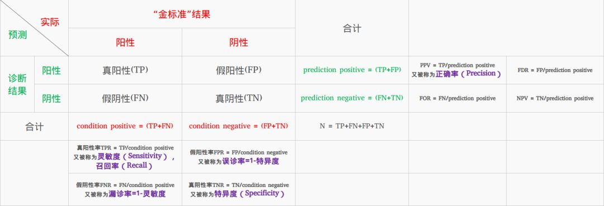

### 混淆矩阵

    准确率(Accuracy): (TP+TN) / (TP + FP  + FN + TN)
    精确率(Precision): TP / (TP + FP)
    召回率(Recall): TP / (TP + FN)
    F1-score: 2 * (Precision * Recall) / (Precision + Recall)
    F2-score: (1 + beta ** 2) * (Precision * Recall) / beta ** 2 * Precision + Recall
        F1是一个用来衡量Precision和Recall的一个指标，往往当F1很高时，Precision和Recall也很高。
    AUC
        AUC是一个衡量模型的指标，当AUC趋近于1，说明该模型的分类效果越好；反之，若AUC趋近于0，说明该模型分类效果越差。
        AUC一般在数据不平衡的情况下使用。（邮件、疾病、推荐）

## 作业
    