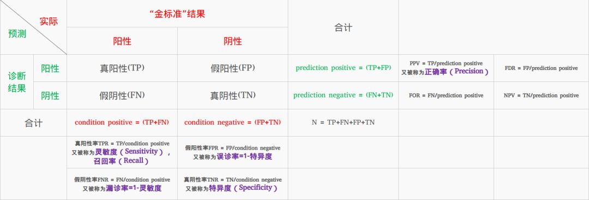

### 混淆矩阵

    准确率(Accuracy): (TP+TN) / (TP + FP  + FN + TN)
    精确率(Precision): TP / (TP + FP)
    召回率(Recall): TP / (TP + FN)
    F1-score: 2 * (Precision * Recall) / (Precision + Recall)
    F2-score: (1 + beta ** 2) * (Precision * Recall) / beta ** 2 * Precision + Recall
        F1是一个用来衡量Precision和Recall的一个指标，往往当F1很高时，Precision和Recall也很高。
    AUC
        AUC是一个衡量模型的指标，当AUC趋近于1，说明该模型的分类效果越好；反之，若AUC趋近于0，说明该模型分类效果越差。
        AUC一般在数据不平衡的情况下使用。（邮件、疾病、推荐）

## 作业
##### 1. 实现softmax，cross-entropy，并且说明他们的使用场景和作用意义；
    softmax是将逻辑回归的输出转换成一组概率， 且这组概率为0-1之间，和为1的概率分布，softmax是一个多分类模型，
    而交叉熵cross_entropy是softmax的损失函数，因为softmax输出的是概率分布，衡量概率分布的相似程度的常用方法是KL散度，
    然后，KL散度和交叉熵几乎是一回事。理论上softmax也可以搭配其他的概率分布，例如 
    loss = sum(y_i * p + (1-yi) * (1 - p))， 但是cross_entropy函数使用了log变换，会在损失远离0时更快的收敛，
    
##### 2. 总结过拟合、欠拟合的作用和意义；
    过拟合是在训练集上拟合很好，在测试集上拟合不好
    欠拟合是在训练集上拟合不好，在测试集上拟合很好
##### 3. 总结AUC的作用和意义；
    AUC 是一个衡量模型的指标, 当AUC趋近于1，说明该模型的分类效果越好；反之若AUC趋近于0，说明该模型分类效果越差
    AUC 一般在数据不平衡的情况下使用，例如邮件分类，疾病预测，推荐系统等
    
##### 4. 城市里边有一共200万个居民，其中有100人是犯罪分子，然后警察随机找了一批人，这批人一共200人： 
    现在定义犯罪分析为positive samples, 那么
    case1: 警察定义的这200人中，一共有犯罪分子实际有89人，警察判定是犯罪分子的人一共有80人，这80人中，真正是犯罪分子的有79名；
预测/真实 | 坏人 | 好人
---|---|---
坏人 | TP: 79 | FP: 1
好人 | FN: 10 | TN: 110

        请问，警察判断的accuracy是多少，recall是多少，precision是多少？
            accuracy = (TP + TN) / (TP + FP + FN + TN) = (89 + 110) / 200 = 94.5%
            recall = TP / (TP + FN) = 79 / 89 = 89%
            precision = TP / (TP + FP) = 79 / 80 = 98.75%
    case2: 警察定义的这200人中，一共有犯罪分子实际有100人，警察判定是犯罪分子的人一共有200人，这200人中，真正是犯罪分子的有100名；
预测/真实 | 坏人 | 好人
---|---|---
坏人 | TP: 100 | FP: 100
好人 | FN: 0 | TN: 0
        请问，警察判断的accuracy是多少，recall是多少，precision是多少？
            accuracy = (TP + TN) / (TP + FP + FN + TN) = 100 / 200 = 50%
            recall = TP / (TP + FN) = 100 / 100 = 100%
            precision = TP / (TP + FP) = 100 / 200 = 50%
##### 5. one-hot的意义以及代码实现方法；
    
##### 6. normalization， standardlized 的意义和代码实现方法。
    